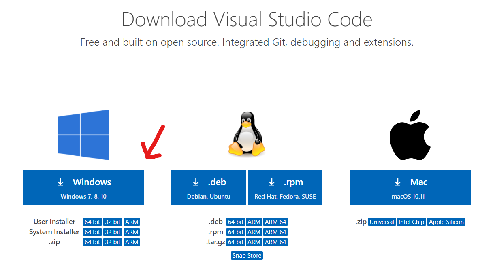
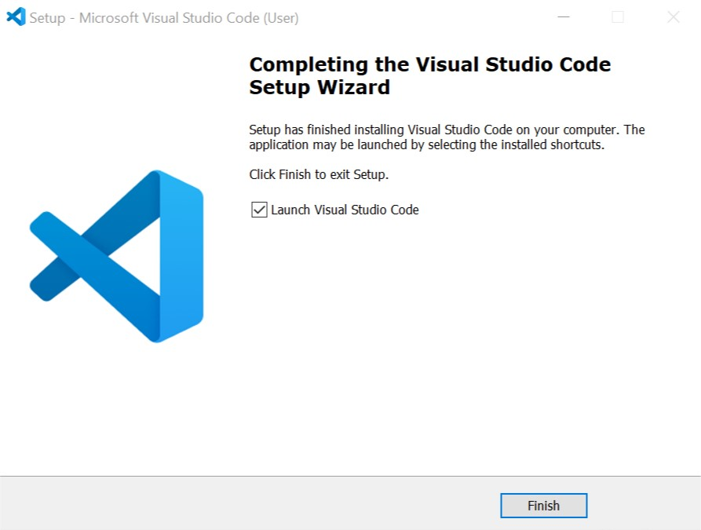
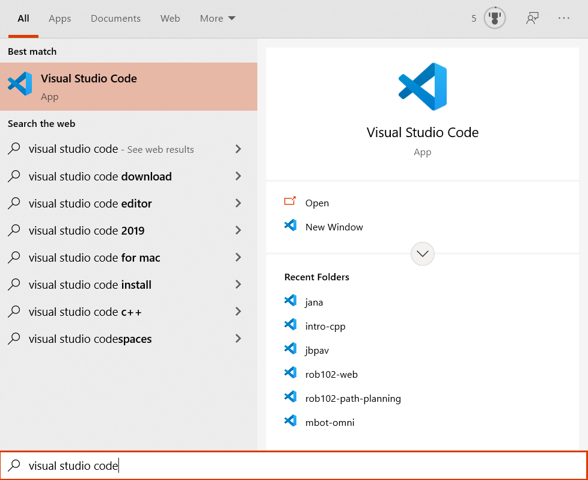
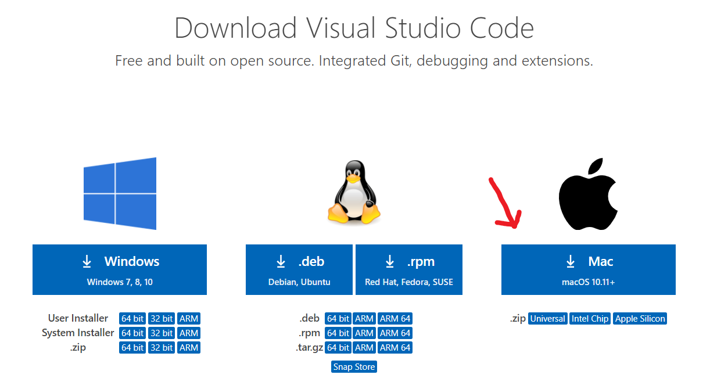
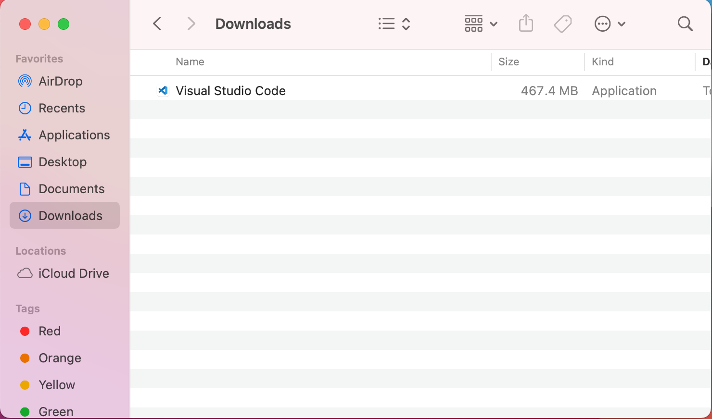
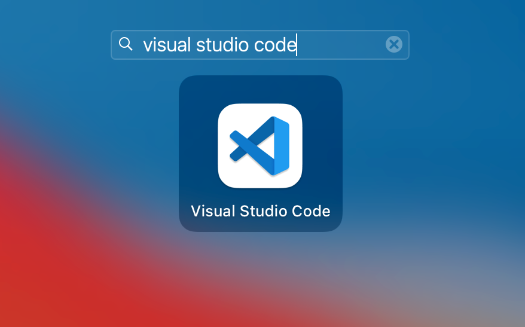
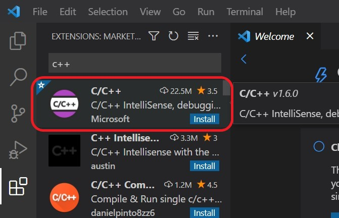

# Computer Setup

This page contains instructions for installing software needed for ROB 102.

## VSCode

Visual Studio Code is the **Integrated Development Environment (IDE)** that we will be using to write C++ code. To install it, follow the instructions for your OS. Then, configure it following the configuration instructions. Finally install the dependencies for this course in the VSCode terminal.

- [Windows](#windows)
- [Mac OS](#mac-os)
- [Linux](#linux)

Note: There is another IDE called Visual Studio. VSCode is different from Visual Studio.

## Installing VSCode

### Windows

1. **Download VSCode:** Download the installer for VSCode for Windows from the [Visual Studio website](https://code.visualstudio.com/download):
{:style="width:500px;" .centered .rd-corners}

2. **Install VSCode:** When the installer finishes downloading, click on it to run it. Click &quot;Yes&quot; when asked to allow the installer to make changes to your computer. Accept the default option for the installation path. If installation is successful, you should see a screen like this one:
{:style="width:500px;" .centered .rd-corners}

3. **Open VSCode:** Open VSCode by searching for &quot;Visual Studio Code&quot; in the search bar:
{:style="width:500px;" .centered .rd-corners}

### Mac OS

1. **Download VSCode:** Download the installer for VSCode for Mac from the [Visual Studio website](https://code.visualstudio.com/download):
{:style="width:500px;" .centered .rd-corners}
    
2. **Add VSCode to applications:** When the installer finishes downloading, find the download using your Finder (look for it in Downloads). Drag and drop the file into your Applications folder.
{:style="width:500px;" .centered .rd-corners}

3. **Open VSCode:** Open VSCode by searching for &quot;Visual Studio Code&quot; in the launchpad:
{:style="width:300px;" .centered .rd-corners}

### Linux

Download the installer for VSCode for Linux from the [Visual Studio website]("https://code.visualstudio.com/download") and follow the instructions to install.

## Configuring VSCode

There are multiple extensions available to configure VSCode to your needs. We recommend installing the C/C++ extension for ROB 102. Later, you might discover more extensions that you find useful. To install an extension, select the &quot;Extensions&quot; icon <span></span> in the bar on the left of the VSCode window. In the search bar, type &quot;C++&quot; and select &quot;Install&quot; for the extension shown below:

{:style="width:500px;" .centered .rd-corners}

## Installing Dependencies
In VSCode, open a new terminal by clicking "Terminal" in the top bar, then "New Terminal" in the drop down menu. Next run one of the following commands in the new terminal, depending on your operating system. You may need to enter your computer password in the terminal, if prompted.

- **Windows:** ```sudo apt update && sudo apt install libgtest-dev```.
- **Mac OS:** ```brew install googletest```.
- **Linux:** ```sudo apt update && sudo apt install libgtest-dev```.
